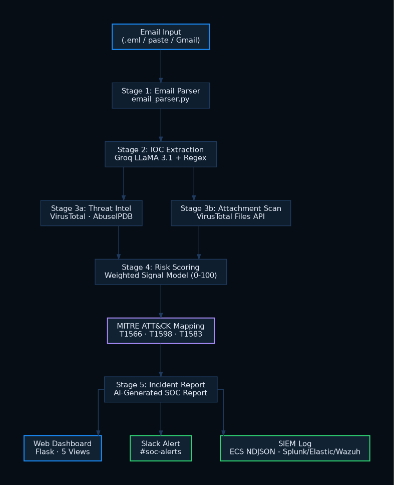

# 🛡️ PhishGuard — AI-Powered Phishing Email Analyzer

> SOC Platform v3.0 | AI Detection + Threat Intelligence + Wazuh SIEM Integration

PhishGuard is a production-grade phishing email analysis platform built for Security Operations Centers. It combines AI-powered parsing, multi-source threat intelligence, and automated SIEM integration to deliver a complete email threat detection pipeline.

---

## 📸 Dashboard Preview


---

## 🏗️ Architecture



```
Email Input
    ↓
AI Parse (Groq LLaMA 3.1)
    ↓
IOC Extraction
    ↓
Threat Intel (VirusTotal + AbuseIPDB)
    ↓
Risk Scoring (Multi-signal weighted)
    ↓
SOC Report + Slack Alert
    ↓
ECS NDJSON Log → Wazuh SIEM (auto-ingest, 24/7 monitoring)
```

---

## ⚡ Detection Pipeline — 6 Stages

| Stage | Component | What It Does |
|-------|-----------|-------------|
| 1 | Email Parser | Extracts headers, body, attachments from raw EML or Gmail paste |
| 2 | AI Parser | Groq LLaMA 3.1 identifies phishing tactics, spoofing, credential harvesting |
| 3 | IOC Extractor | Extracts URLs, domains, IPs — maps to MITRE ATT&CK |
| 4 | Threat Intel | VirusTotal URL scan + AbuseIPDB IP reputation check |
| 5 | Risk Scorer | Multi-signal weighted scoring engine (0–100) |
| 6 | Reporter | Generates SOC incident report + Slack alert + ECS SIEM log |

---

## 🎯 Risk Scoring Signals

| Signal | Points | Description |
|--------|--------|-------------|
| AI confidence ≥70% | +40 | LLaMA 3.1 phishing likelihood score |
| Brand impersonation | +25 | Microsoft/PayPal/Apple mentioned but URL not on real domain |
| Credential harvesting | +20 | Password reset, MFA setup, bank details requested |
| Typosquatting detected | +20 | Domain within Levenshtein distance 2 of known brand |
| VirusTotal hit | +30 | URL flagged malicious by security engines |
| Time pressure tactic | +10 | "expires in 24 hours", "act now", "immediate action" |
| Suspicious domain | +10 | Unknown domain with suspicious structure, 0 VT hits |
| Trusted domain override | cap 20 | All URLs on verified domains (Google, GitHub, PayPal, Chase) |

---

## 🔗 Wazuh SIEM Integration

PhishGuard outputs **ECS-formatted NDJSON logs** automatically ingested by Wazuh SIEM.

### Pipeline

```
PhishGuard detects phishing
        ↓
Writes ECS log to output/siem_logs.ndjson
        ↓
Wazuh logcollector reads file (24/7, automatic)
        ↓
Custom rules fire:
  Rule 100001 — Level 10 — HIGH risk → MITRE T1566.002
  Rule 100002 — Level 6  — MEDIUM risk → MITRE T1566
        ↓
Alert stored in /var/ossec/logs/alerts/alerts.json
```

### Live Alert Example

```json
{
  "timestamp": "2026-03-08T14:30:28+0545",
  "rule": {
    "level": 10,
    "description": "PhishGuard: HIGH risk phishing email detected",
    "id": "100001",
    "mitre": {
      "id": ["T1566.002"],
      "tactic": ["Initial Access"],
      "technique": ["Spearphishing Link"]
    }
  },
  "data": {
    "email": {
      "from": "security-noreply@microsoft-365-auth.com",
      "subject": "[Microsoft 365] Multi-Factor Authentication Required"
    },
    "phishguard": {
      "risk_score": "80",
      "risk_level": "HIGH",
      "action": "BLOCK IP | QUARANTINE EMAIL | ESCALATE TO L2"
    }
  }
}
```

### Monitor Alerts in Real Time

```bash
sudo tail -f /var/ossec/logs/alerts/alerts.json | grep PhishGuard
```

---

## 📊 Real-World Detection Results

| Email | Expected | Score | Result |
|-------|----------|-------|--------|
| Microsoft 365 MFA phish (microsoft-365-auth.com) | HIGH | 80/100 | ✅ |
| Apple ID typosquat (appie-id-verify.com) | HIGH | 90/100 | ✅ |
| Netflix typosquat (netfiix-billing.com) | HIGH | 90/100 | ✅ |
| Payroll bank update (company-payroll-update.net) | HIGH | 75/100 | ✅ |
| DocuSign contract phish (docusign-secure-sign.com) | HIGH | 65/100 | ✅ |
| IT password expiry phish (corp-itsupport.net) | HIGH | 65/100 | ✅ |
| Real Google alert (myaccount.google.com) | LOW | 10/100 | ✅ |
| Real Chase statement (chase.com) | LOW | 5/100 | ✅ |
| Real PayPal notification (paypal.com) | LOW | 0/100 | ✅ |
| Real LinkedIn (linkedin.com) | LOW | 0/100 | ✅ |

**10/10 correct — Zero false positives on legitimate emails**

---

## 🎯 MITRE ATT&CK Coverage

| Technique ID | Name | Tactic |
|-------------|------|--------|
| T1566.002 | Spearphishing Link | Initial Access |
| T1566.001 | Spearphishing Attachment | Initial Access |
| T1598.003 | Spearphishing Link (Recon) | Reconnaissance |
| T1204 | User Execution | Execution |
| T1078 | Valid Accounts | Initial Access |

---

## 🛠️ Tech Stack

| Component | Technology |
|-----------|-----------|
| AI Engine | Groq API — LLaMA 3.1 70B |
| Threat Intel | VirusTotal API + AbuseIPDB API |
| SIEM | Wazuh 4.14 |
| Log Format | ECS NDJSON (Elastic Common Schema) |
| Alerting | Slack Webhooks |
| Backend | Python 3.11 + Flask |
| Dashboard | HTML / CSS / JavaScript |

---

## 📁 Project Structure

```
PhishGuard/
├── src/
│   ├── email_parser.py         # Header, body, attachment extraction
│   ├── ioc_extractor.py        # URL/IP/domain extraction + MITRE mapping
│   ├── enrichment.py           # VirusTotal + AbuseIPDB lookups
│   ├── risk_scorer.py          # Multi-signal weighted scoring engine
│   ├── reporter.py             # SOC incident report generation
│   ├── slack_alert.py          # Slack webhook integration
│   └── siem_logger.py          # ECS NDJSON log writer
├── web/
│   ├── app.py                  # Flask web server
│   └── templates/index.html    # SOC dashboard UI
├── output/
│   ├── report_*.txt            # Generated incident reports
│   └── siem_logs.ndjson        # SIEM log (watched by Wazuh)
├── phishguard_rules.xml        # Custom Wazuh detection rules
├── screenshot/
│   ├── dashbaord_preview.png   # Dashboard screenshot
│   └── architecture.png        # Architecture diagram
├── sample_emails/              # Test EML files
├── main.py                     # CLI entry point
├── requirements.txt
└── .env.example
```

---

## ⚙️ Installation

### Prerequisites
- Python 3.11+
- Wazuh Manager 4.x (optional, for SIEM integration)
- API keys: Groq, VirusTotal, AbuseIPDB, Slack webhook

### Install

```bash
git clone https://github.com/RishavTh/AI-Phising-Analyzer.git
cd AI-Phising-Analyzer
pip install -r requirements.txt
cp .env.example .env
# Fill in your API keys in .env
```

### Run Web Dashboard

```bash
python3 web/app.py
# Open http://localhost:5000
```

### Run CLI

```bash
python3 main.py --email sample_emails/test_phishing.eml
```

### Wazuh SIEM Setup

```bash
# 1. Add to /var/ossec/etc/ossec.conf
<localfile>
  <log_format>json</log_format>
  <location>/path/to/PhishGuard/output/siem_logs.ndjson</location>
</localfile>

# 2. Copy detection rules
sudo cp phishguard_rules.xml /var/ossec/etc/rules/

# 3. Restart Wazuh
sudo /var/ossec/bin/wazuh-control restart

# 4. Monitor alerts
sudo tail -f /var/ossec/logs/alerts/alerts.json | grep PhishGuard
```

---

## 🔑 Environment Variables

```env
GROQ_API_KEY=your_groq_key
VIRUSTOTAL_API_KEY=your_vt_key
ABUSEIPDB_API_KEY=your_abuseipdb_key
SLACK_WEBHOOK_URL=your_slack_webhook
```


*Built to demonstrate end-to-end SOC email threat detection — AI detection + threat intelligence + SIEM integration + MITRE ATT&CK mapping*
