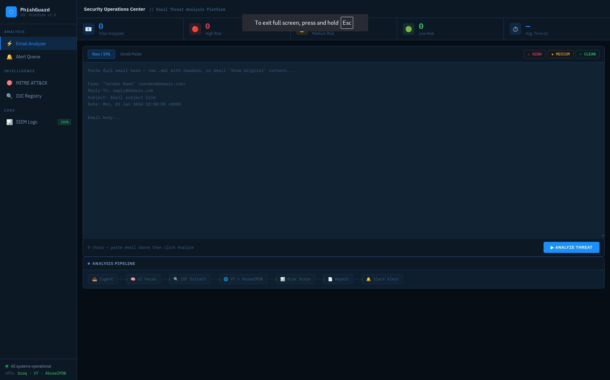

# PhishGuard

Automated phishing email analysis pipeline with a SOC-style web dashboard.



## Overview

PhishGuard is a 6-stage pipeline that takes a raw email as input and produces a structured threat assessment — IOCs, risk score, MITRE ATT&CK mapping, enriched threat intel, attachment scan results, and a full incident report.
```
Email Input → IOC Extraction → Threat Intel Enrichment → Attachment Scan → Risk Score → Report + Alert
```

**Stack:** Python 3.11 · Groq LLaMA 3.1 · VirusTotal API v3 · AbuseIPDB · Flask · Slack Webhooks

---

## Pipeline

| Stage | Module | Description |
|-------|--------|-------------|
| 1 | `email_parser.py` | Parses raw `.eml` — headers, body, HTML links |
| 2 | `ioc_extractor.py` | LLM IOC extraction with regex IP fallback |
| 3 | `enrichment.py` | VirusTotal URL scan + AbuseIPDB IP lookup |
| 3b | `attachment_scanner.py` | VirusTotal Files API — SHA256 lookup + upload |
| 4 | `risk_scorer.py` | Weighted signal model, 0–100 score |
| 5 | `reporter.py` | AI-generated SOC incident report |
| 6 | `slack_alert.py` | Slack webhook for MEDIUM/HIGH alerts |

---

## Web Dashboard

Flask dashboard at `localhost:5000` with five views:

| View | Description |
|------|-------------|
| Email Analyzer | Paste raw EML or Gmail "Show Original" — runs full pipeline |
| Alert Queue | Session history table, exportable as CSV |
| MITRE ATT&CK | All techniques detected across session |
| IOC Registry | Accumulated URLs, domains, IPs across all analyses |
| SIEM Logs | ECS NDJSON viewer with `.ndjson` download |

---

## Risk Scoring Model

| Signal | Points |
|--------|--------|
| AI confidence > 70% | +40 |
| VirusTotal malicious > 10 engines | +25 |
| VirusTotal malicious 3–10 engines | +15 |
| VirusTotal malicious 1–3 engines | +5 |
| AbuseIPDB score > 60% | +20 |
| AbuseIPDB score 30–60% | +10 |
| Tor exit node detected | +10 |
| Sender spoofing detected | +10 |
| Credential harvesting detected | +5 |
| All signals clean | Score capped at 30 |

**LOW** 0–29 · **MEDIUM** 30–70 · **HIGH** 71–100

---

## MITRE ATT&CK Mapping

| Technique ID | Name | Tactic |
|-------------|------|--------|
| T1566.001 | Spearphishing Attachment | Initial Access |
| T1566.002 | Spearphishing Link | Initial Access |
| T1598.003 | Spearphishing Link | Reconnaissance |
| T1566 | Phishing | Initial Access |
| T1583.001 | Acquire Domain | Resource Development |

---

## Attachment Scanning

- Extracts attachments from `.eml` files automatically
- SHA256 hash lookup against VirusTotal cache before uploading
- Falls back to direct file upload + result polling for unknown files
- Covers PDF, Word, Excel, ZIP, EXE, PS1, BAT, JS, ISO
- Skips files over 5MB and non-suspicious types

---

## SIEM Logging

Every analysis is appended to `output/siem_logs.ndjson` automatically.

- Elastic Common Schema (ECS) compatible — one JSON object per line
- Ingestible directly by Splunk, Elastic, and Wazuh without transformation
- Persistent across server restarts
- Exposed via `/siem-logs` API endpoint with stats summary

---

## Setup

**Prerequisites:** Python 3.11+, API keys for Groq, VirusTotal, AbuseIPDB
```bash
git clone https://github.com/RishavTh/AI-Phising-Analyzer.git
cd AI-Phising-Analyzer
pip3 install -r requirements.txt
cp .env.example .env
```

**.env:**
```
GROQ_API_KEY=
VIRUSTOTAL_API_KEY=
ABUSEIPDB_API_KEY=
SLACK_WEBHOOK_URL=
```

**CLI:**
```bash
python3 main.py sample_emails/test_phishing.eml
```

**Web:**
```bash
python3 web/app.py
```

---

## Project Structure
```
src/
├── email_parser.py
├── ioc_extractor.py
├── ip_extractor.py
├── enrichment.py
├── attachment_scanner.py
├── risk_scorer.py
├── reporter.py
├── slack_alert.py
└── siem_logger.py
web/
├── app.py
└── templates/index.html
sample_emails/
output/
main.py
```

---

## Security

- Rate limiting: 10 req/min, 100 req/hour per IP
- Input validation: 20–100,000 character bounds
- Temp files cleaned up in `finally` block on every request
- API keys in `.env`, excluded from version control
- Debug mode controlled by `FLASK_DEBUG` environment variable
